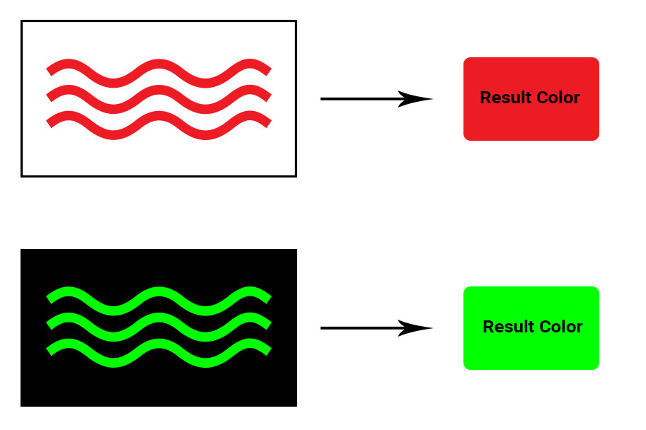

# hue-ambiance: A Python script for Philips Hue
Sync Philips Hue lights with computer screen in real time

## Prerequisites:
- Python environment
- Pip: ```apt get install python-pip```
- OpenCV Python: ```pip install opencv-python```
- MSS: ```pip install mss```
- PHue: ```pip install phue```

## Usage:

Make sure you set the ```MY_LIGHT_NAMES``` and ```BRIDGE_IP``` variables to match your Hue System.

**Press the Hue Bridge button before running the script for the first time!**

Run the script in the terminal: 

```
python hue_ambiance.py
```

Feel free to tweak setup variables in order to obtain preferred effect.

Enjoy!


## How it works:

1) Use **Python MSS** to grab a screen capture

2) Shrink the captured image in order to increase computation speed. Check out ```INPUT_IMAGE_REDUCED_SIZE``` variable.

3) Use ```cv2.matchTemplate``` to check the difference between current and previously used frame. If the difference is smaller than the ```FRAME_MATCH_SENSITIVITY``` variable then the frame is skipped in order to prevent redundant calculations and requests.
Let's suppose we have following frame:


4) Make a grayscale copy of the image and apply OpenCV threshold function in order to calcuate mask:


5) Apply mask to image:


6) Compare the count of non zero value pixels in the image with ```MIN_NON_ZERO_COUNT```.
If the count is too little, then turn off/dim the lights.
If ```VARIABLE_BRIGHTNESS_MODE``` is set to true then brightness is calculated based on the non zero pixel count.
If ```DIM_LIGHTS_INSTEAD_OF_TURN_OFF``` is set to true then, whenever the count is below the lower threshold ```MIN_NON_ZERO_COUNT```, the lights are being dimmed instead of turned off.

3) Apply **OpenCV K Means Clustering** in order to find main image colors.
Result will look like:


4) Calculate which of the colors calculated in step 3 should be sent to Philips Hue lights.
If the most prevalent color is either too dark or too bright it means that we have an image with bright or dark background. In this case we look for the next color until we find a color that suits the conditions.


5) Check whether the calculated color is different than the one already in use. Tweak ```COLOR_SKIP_SENSITIVITY``` variable to change the sensitivity.

6) Finally, we have the ```CAN_UPDATE_HUE``` variable that allows us to update the lights. This variable is used to prevent bridge request bottlenecks and is cleared by a timeout. Timeout duration can be adjusted by changing ```HUE_MAX_REQUESTS_PER_SECOND``` variable.

7) If the above flag is clear we can finally update the lights: change color, brightness, dim or switch them on/off :)


## Based on:

http://python-mss.readthedocs.io/examples.html

https://docs.opencv.org/3.0-beta/doc/py_tutorials/py_ml/py_kmeans/py_kmeans_opencv/py_kmeans_opencv.html

https://www.developers.meethue.com/

https://github.com/studioimaginaire/phue

https://github.com/benknight/hue-python-rgb-converter

